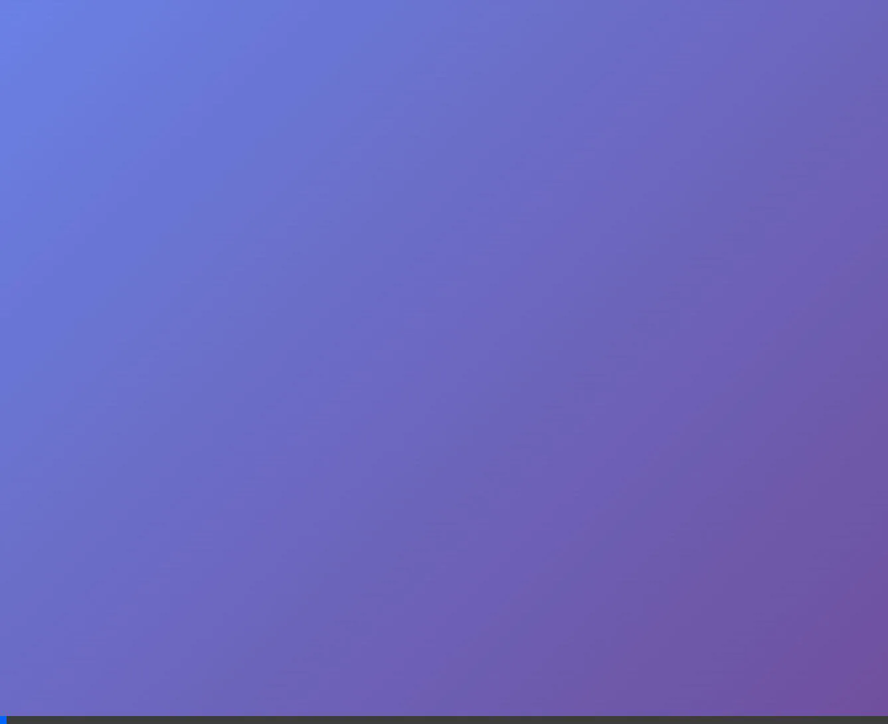

# 📋 Quiz Tin Học Lớp 4 - Tổng Hợp Task

> **Ngày cập nhật:** 19/01/2026 22:55  
> **Trạng thái tổng thể:** ✅ Hoàn thành v1.0 (Next.js 15, Animation, Sound)

---

## 📊 Tổng quan dự án

Ứng dụng Quiz Tin Học dành cho học sinh Lớp 4, đã hoàn thành chuyển đổi từ **vanilla HTML/CSS/JS** sang **Next.js 15** với TypeScript.
Phiên bản mới bao gồm đầy đủ **hiệu ứng động (animations)** và **Confetti** tương tác.

---

## ✅ Công việc đã hoàn thành

### 1. Phiên bản gốc (Vanilla HTML/CSS/JS)

| Task | Mô tả | Ngày hoàn thành |
|------|-------|-----------------|
| ✅ Quiz App cơ bản | Tạo ứng dụng quiz với 15 câu hỏi tin học | Trước 15/01/2026 |
| ✅ CSS Design System | Thiết kế giao diện đẹp, hiệu ứng động | Trước 15/01/2026 |
| ✅ Unit Tests | 29 unit tests cho QuizApp, DOMManager, QuizController | Trước 15/01/2026 |

### 2. Cải thiện Layout (15/01/2026)

| Task | Mô tả | Trạng thái |
|------|-------|------------|
| ✅ Two-Column Layout | Hình bên trái, nội dung bên phải (desktop) | Hoàn thành |
| ✅ Compact Navigation | Ẩn navigation dots, dùng prev/next buttons | Hoàn thành |
| ✅ Sidebar với Question Status | Hiển thị trạng thái các câu hỏi | Hoàn thành |
| ✅ Hình ảnh trong Hint | Di chuyển ảnh vào phần hint | Hoàn thành |
| ✅ Responsive Design | Layout 1 cột trên mobile | Hoàn thành |

### 3. Chuyển đổi Next.js (19/01/2026) ✅

#### Phase 1: Setup ✅
| Task | Trạng thái |
|------|------------|
| ✅ Khởi tạo Next.js 15 với TypeScript | Hoàn thành |
| ✅ Cấu hình Vitest + Testing Library | Hoàn thành |
| ✅ Setup ESLint | Hoàn thành |

#### Phase 2: Core Logic ✅
| Task | Trạng thái |
|------|------------|
| ✅ Tạo TypeScript types (`src/lib/types.ts`) | Hoàn thành |
| ✅ Migrate questions data (`src/lib/questions.ts`) | Hoàn thành |
| ✅ Tạo `useQuiz` hook | Hoàn thành |
| ✅ Viết tests cho `useQuiz` (18 tests passing) | Hoàn thành |

#### Phase 3: UI Components ✅
| Task | Trạng thái |
|------|------------|
| ✅ `Button.tsx` + CSS Module | Hoàn thành |
| ✅ `ProgressBar.tsx` + CSS Module | Hoàn thành |
| ✅ `Confetti.tsx` + CSS Module | Hoàn thành |
| ✅ `WelcomeScreen.tsx` + CSS Module | Hoàn thành |
| ✅ `HintBox.tsx` + CSS Module | Hoàn thành |
| ✅ `OptionButton.tsx` + CSS Module | Hoàn thành |
| ✅ `Sidebar.tsx` + CSS Module | Hoàn thành |
| ✅ `QuestionCard.tsx` + CSS Module | Hoàn thành |
| ✅ `QuizScreen.tsx` + CSS Module | Hoàn thành |
| ✅ Auto-advance (tự chuyển câu) | Hoàn thành |
| ✅ Move Navigation to Sidebar (Desktop) | Hoàn thành |
| ✅ Style Hint Image (Modern & Responsive) | Hoàn thành |
| ✅ Fix: Hint tự mở khi chuyển câu | Hoàn thành |
| ✅ `ResultScreen.tsx` + CSS Module | Hoàn thành |
| ✅ `ReviewList.tsx` + CSS Module | Hoàn thành |

#### Phase 4: Integration ✅
| Task | Trạng thái |
|------|------------|
| ✅ Tạo Design System CSS Variables | Hoàn thành |
| ✅ Wire up `app/page.tsx` với screen transitions | Hoàn thành |
| ✅ Kiểm tra trên browser | Hoàn thành |

### Phase 6: Optimization & Cleanup ✅
| Task | Trạng thái |
|------|------------|
| ✅ Dọn dẹp file rác và backup | Hoàn thành |
| ✅ Code Linting & Fix | Hoàn thành |
| ✅ Áp dụng `React.memo` cho Components | Hoàn thành |
| ✅ Xác minh hệ thống (Build/Test) | Hoàn thành |


---

## 🔲 Công việc tùy chọn (Có thể làm sau)

### Phase 5: Testing & Optimization

| # | Task | Ưu tiên | Ước tính |
|---|------|---------|----------|
| 1 | Viết component tests (React Testing Library) | 🟡 Trung bình | 2-3 giờ |
| 2 | E2E testing với Playwright | 🟢 Thấp | 2-3 giờ |
| 3 | Bundle optimization (analyze & optimize) | 🟢 Thấp | 1-2 giờ |
| 4 | Performance audit (Lighthouse) | 🟢 Thấp | 1 giờ |
| 5 | Triển khai lên Vercel | 🟢 Thấp | 1 giờ |

---

## 📁 Cấu trúc thư mục hiện tại

```
src/
├── app/                      # Next.js App Router
│   ├── layout.tsx           # ✅ Root layout
│   ├── page.tsx             # ✅ Main page with screen transitions
│   └── globals.css          # ✅ Design system CSS
├── components/
│   ├── ui/                  # ✅ Atomic components
│   │   ├── Button.tsx       # ✅ Done
│   │   ├── ProgressBar.tsx  # ✅ Done  
│   │   ├── Confetti.tsx     # ✅ Done
│   │   └── index.ts         # ✅ Done
│   └── quiz/                # ✅ Quiz-specific components
│       ├── WelcomeScreen.tsx # ✅ Done
│       ├── HintBox.tsx       # ✅ Done
│       ├── OptionButton.tsx  # ✅ Done
│       ├── Sidebar.tsx       # ✅ Done
│       ├── QuestionCard.tsx  # ✅ Done
│       ├── QuizScreen.tsx    # ✅ Done
│       ├── ResultScreen.tsx  # ✅ Done
│       ├── ReviewList.tsx    # ✅ Done
│       └── index.ts          # ✅ Done
├── hooks/
│   ├── useQuiz.ts           # ✅ Done (18 tests)
│   └── __tests__/
│       └── useQuiz.test.ts  # ✅ Done
└── lib/
    ├── types.ts             # ✅ TypeScript types
    └── questions.ts         # ✅ Quiz data (15 câu hỏi)
```

---

## 🎥 Demo



---

## 🚀 Chạy ứng dụng

```bash
# Development
npm run dev

# Build
npm run build

# Test
npm test
```

---

## 📝 Ghi chú

> [!NOTE]  
> Dự án đã hoàn thành chuyển đổi sang Next.js 15 với đầy đủ các tính năng.

> [!TIP]
> Có thể tiếp tục thêm component tests và E2E tests để tăng độ tin cậy.

---

*Cập nhật cuối: 19/01/2026 23:05*
