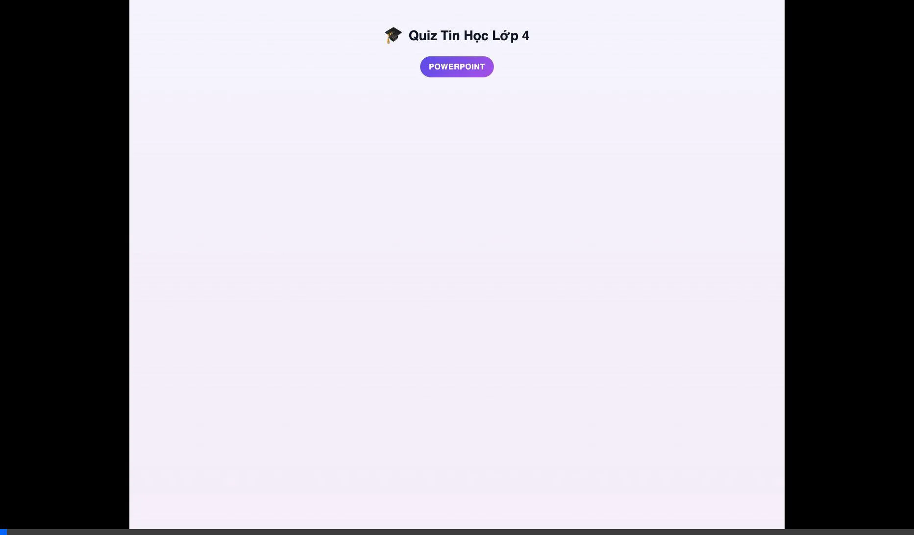

# 🎮 Quiz Tin Học Lớp 4 - Walkthrough

## Tổng quan

Đã xây dựng hoàn chỉnh ứng dụng quiz tương tác giúp học sinh lớp 4 ôn tập Tin học - Chủ đề PowerPoint.
**Cập nhật mới:** Tính năng Hint/Gợi ý thông minh.

---

## Files đã tạo/Cập nhật

| File | Mô tả |
|------|-------|
| [index.html](file:///Users/macintoshhd/Project/Kola/4A5/Tinhoc/index.html) | Giao diện HTML chính + Hint UI |
| [styles.css](file:///Users/macintoshhd/Project/Kola/4A5/Tinhoc/src/styles.css) | CSS với animations + Hint styles |
| [app.js](file:///Users/macintoshhd/Project/Kola/4A5/Tinhoc/src/app.js) | Logic ứng dụng + Hint logic |
| [questions.js](file:///Users/macintoshhd/Project/Kola/4A5/Tinhoc/src/data/questions.js) | 15 câu hỏi + 15 Hints |
| [app.test.js](file:///Users/macintoshhd/Project/Kola/4A5/Tinhoc/tests/app.test.js) | Unit tests (24 tests pass) |

---

## Tính năng

### 1. Màn hình chào mừng
- Tiêu đề thân thiện với emoji
- Nút "Bắt đầu Quiz!" bắt mắt

### 2. Quiz tương tác
- 15 câu hỏi trắc nghiệm từ đề cương PDF
- Hiệu ứng confetti 🎉 khi trả lời đúng
- Hiệu ứng shake khi trả lời sai
- Thanh progress bar cập nhật realtime

### ✨ 3. Tính năng Hint/Gợi ý & Hình ảnh (MỚI)
- **Hình ảnh minh họa:** Mỗi câu hỏi đều có hình ảnh trực quan giúp trẻ dễ hình dung.
- **Nút Hint:** Mỗi câu hỏi có nút "💡 Gợi ý" màu vàng
- **Gợi ý thông minh:** Hiển thị gợi ý giúp con suy nghĩ mà không lộ đáp án
- **Giới hạn:** Mỗi câu chỉ được dùng gợi ý 1 lần
- **Trạng thái:** Nút hint tự động disabled sau khi dùng hoặc sau khi đã trả lời

### 4. Kết quả & Xem lại
- Hiển thị điểm số và phần trăm
- **Thống kê:** Hiển thị số lượng gợi ý đã dùng
- **Badge:** Đánh dấu "💡 Đã dùng gợi ý" trong phần xem lại đáp án

---

## TDD - Test Results

```
📚 Testing Data...
✅ Each question should have hint field

💡 Testing Hint Feature...
✅ QuizApp should initialize with empty hintsUsed array
✅ useHint should return hint and mark as used
✅ useHint should only work once per question
✅ useHint should not work after answer is selected
✅ Hints should be tracked per question independently
✅ getResults should include hints usage stats

Total: 24/24 tests passed ✅
```

---

## Demo Features

### Hint Feature


### Image Feature


---

## Cách sử dụng

```bash
# Mở trong browser (hoặc dùng Live Server)
open /Users/macintoshhd/Project/Kola/4A5/Tinhoc/index.html

# Chạy tests
node /Users/macintoshhd/Project/Kola/4A5/Tinhoc/tests/app.test.js
```
